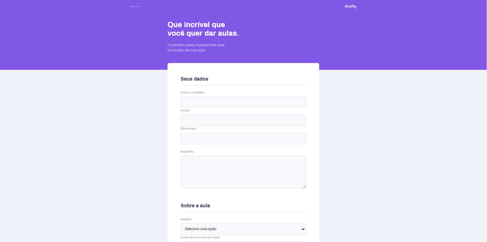

<h1 align="center">
    
</h1>

<h4 align="center">
    An application to connect students and teachers in love about learning
</h4>

---

<p align="center">
  

  

  

  
</p>

<h2>📔 Description</h2>

## This application was developed to connect students and teachers in love about learning

`Web Application`

<details>
  <summary>See</summary>




</details>

`Mobile`

<details>
  <summary>See</summary>


</details>

<h2>🚀 Technologies</h2>

- [Typescript](https://www.typescriptlang.org/)
- [NodeJS](https://nodejs.org)
- [ReactJS](https://reactjs.org/)
- [ReactNative](https://reactnative.dev/)
- [Expo](https://expo.io/)
- [Axios](https://github.com/axios/axios)
- [ESLint](https://eslint.org/)
- [Express](https://expressjs.com/pt-br/)
- [Prettier](https://prettier.io/)
- [SQLite](https://www.sqlite.org/index.html)
- [Responsive Components]()

---

<h2>❓ How to use</h2>

`Backend`

```bash
# Clone this repository
$ git clone https://github.com/gustavosimon/proffy/tree/master/server

# Go into the repository
$ cd proffy/server

# Install dependencies for the backend
$ yarn

# Run the backend server
$ yarn dev
```

`Web`

```bash
# Clone this repository
$ git clone https://github.com/gustavosimon/proffy/tree/master/web

# Go into the repository
$ cd proffy/web

# Install dependencies for the frontend
$ yarn

# Run the frontend
$ yarn start

```

`Mobile`

```bash
# Clone this repository
$ git clone https://github.com/gustavosimon/proffy/tree/master/mobile

# Go into the repository
$ cd proffy/mobile

# Install dependencies for the mobile
$ yarn

# Start React Native Server in Android
$ yarn android

# Start React Native Server in IOS
$ yarn ios

# Open EXPO in your cellphone and scan the QRCode
```

Made by [Gustavo Simon!](https://www.linkedin.com/in/gustavo-simon)

[Rocketseat](https://rocketseat.com.br/)
